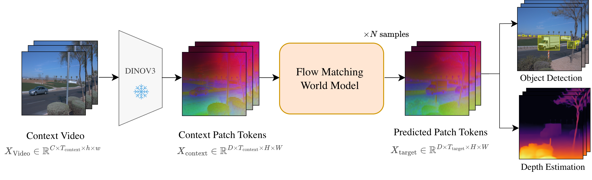
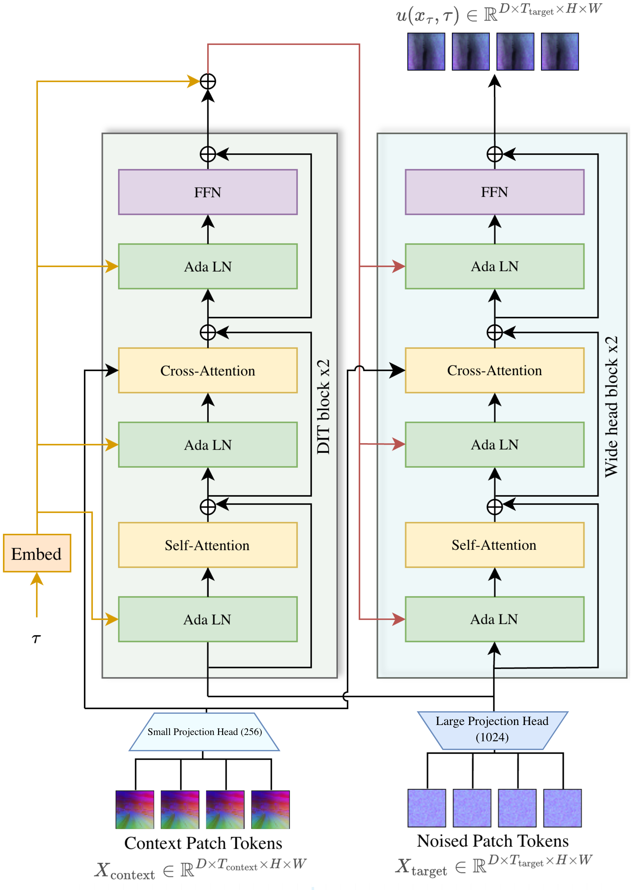
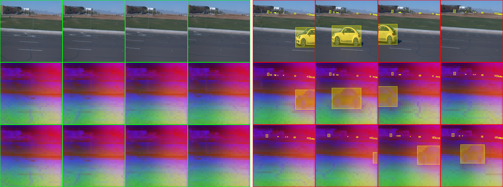
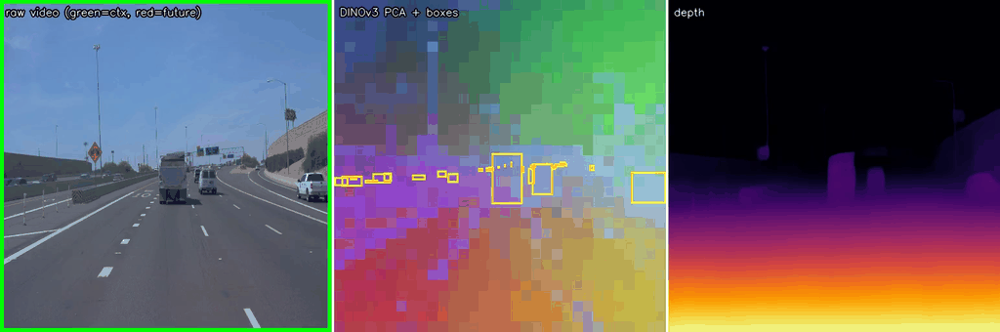
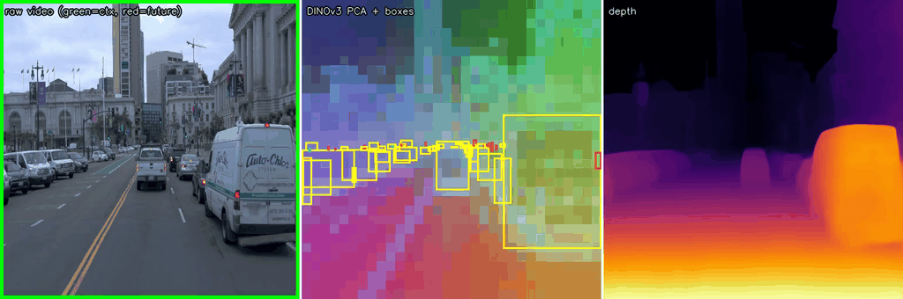
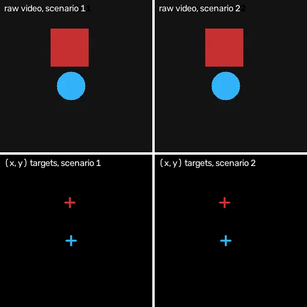

<h1 align="center">
    <p>🔮 <b>FlowWM</b></p>
</h1>

<h2 align="center">
    <p><i>Flow Matching in Feature Space for Stochastic World Modeling</i></p>
</h2>

<div align="center" style="line-height: 1;">
  <a href="https://github.com/facebookresearch/Flow-World-Models" target="_blank" style="margin: 2px;"></a>
  <a href="https://arxiv.org/abs/2606.29059" target="_blank" style="margin: 2px;"></a>
</div>

<br>

<p align="center">
  <a href="https://scholar.google.com/citations?user=LgHZ8hUAAAAJ&hl=en">François Porcher</a><sup>1</sup>,
  Nicolas Carion<sup>1</sup>,
  Karteek Alahari<sup>2</sup>,
  Shizhe Chen<sup>2</sup>
  <br>
  <sup>1</sup>FAIR at Meta &nbsp;&nbsp;&nbsp; <sup>2</sup>Inria
</p>

<p align="justify">
  State-of-the-art visual world models face a trade-off. VAE-based models are stochastic but
  operate in weak reconstruction latents, while models built on strong pretrained features
  (e.g. DINO-Foresight, DINO-WM) keep the representation but are deterministic, collapsing
  multi-modal futures into a blurry mean. Doing flow matching or diffusion directly in these
  high-dimensional feature spaces is notoriously hard. This work contributes:
</p>

- 🔮 **FlowWM**, a step toward stochastic world models that keep strong representations: flow matching directly in pretrained feature space (DINOv3).
- 📊 **FuturePerception**, a benchmark on the Waymo dataset that scores forecasts by downstream perception (object detection) and depth estimation.
- 📄 A paper detailing the design choices that make high-dimensional feature-space flow matching work ([arXiv](https://arxiv.org/abs/2606.29059)).

<p align="center">
  
</p>

---

# 🏗️ Model Architecture

<p align="justify">
  A DiT-style predictor cross-attends noised target tokens to the context features to regress the flow-matching velocity; a <b>wide</b> projection head (1024-d vs. 256-d for context) is crucial for modeling this high-dimensional velocity field. The <code>time_dist_shift</code> config skews sampled timesteps toward noisier regions (train and inference) and is the key hyperparameter to tune.
</p>

<p align="center">
  
</p>


---

# 🚀 Installation

Install `uv`, then run:

```bash
uv sync
```

---

# 🏁 Benchmarks

We introduce two new benchmarks: **FuturePerception** (real-world, based on the Waymo dataset) and **Bouncing Shapes** (synthetic).

## 🚗 Benchmark 1: Waymo / FuturePerception

<p align="justify">
  Real-world future prediction on the <a href="https://waymo.com/open/">Waymo Open Dataset</a>, evaluated through downstream perception
  rather than pixel reconstruction. Each clip provides <b>4 context frames</b> to forecast the
  <b>next 12 frames</b>.
</p>

### Model predictions

<p align="center">
  
</p>

### FuturePerception Benchmark: Samples

<p align="center">
  
  
</p>
<p align="center">
  <sub>Each row is a validation clip. <b>Left</b>: raw frames (green = context, red = future). <b>Middle</b>: DINOv3 feature PCA with ground-truth object boxes. <b>Right</b>: monocular depth predicted from the same DINOv3 features.</sub>
</p>

### 1. Get it (download + convert)

Download the raw **Waymo Open Dataset v1.4.3** tfrecords, then convert them to the WaymoCOCO
layout with the bundled converter, which runs in its own isolated env (see
[`datasets/waymo/README.md`](datasets/waymo/README.md)):

```bash
cd datasets/waymo
uv sync                              # one-time: isolated converter env (TensorFlow + CPU torch)
uv run python convert_waymo_to_coco.py \
  --tfrecord_dir /path/to/waymo_v1_4_3/validation \
  --work_dir     /path/to/waymococo_f0 \
  --image_dirname val2020 --video_dirname validation_video_tensors \
  --image_filename_prefix val --label_filename instances_val2020.json \
  --add_waymo_info --write_image
# repeat with training / train / training_video_tensors for the train split
```

### 2. What it creates

```text
/path/to/datasets/waymococo_f0/
├── annotations/
│   ├── instances_train2020.json          # COCO detection labels (3 classes)
│   └── instances_val2020.json
├── training_video_tensors/
│   ├── {clip_id}.pt                       # [16, 3, 512, 512] uint8 clip  ← world-model input
│   └── df_metadata.csv                    # clip to frames / image_ids mapping
└── validation_video_tensors/ ...
```

The video tensors train the world model; the COCO annotations are the ground truth for the
**FuturePerception** benchmark, where a detector is run on the predicted future features and scored
with COCO AP (perception quality, not pixel reconstruction).

### 3. Point training at it

Set the paths in the config you launch (e.g.
`configs/dinov3/flow_matching_rae_waymo/base/384/`):

```yaml
datasets:
  dataset_name: "waymo"
  train:
    waymo:
      root: /path/to/datasets/waymococo_f0/training_video_tensors
      path_annotations: /path/to/datasets/waymococo_f0/annotations/instances_train2020.json
  val:       # val_mini uses the same validation paths
    waymo:
      root: /path/to/datasets/waymococo_f0/validation_video_tensors
      path_annotations: /path/to/datasets/waymococo_f0/annotations/instances_val2020.json
```

## 🟦 Benchmark 2: Bouncing Shapes (synthetic)

<p align="justify">
  A circle and a square bounce around a box; each wall bounce is <b>stochastic</b>, so one
  observed past has several equally-valid futures. Because the dynamics are fully known, every
  ground-truth future of a clip is available, so you can measure accuracy, diversity, and mode
  coverage exactly. The generator is fully configurable (clip length, resolution, speeds,
  branching), so the benchmark is easy to adapt or extend. Nothing to download: you generate it
  locally.
</p>

<p align="center">
  
</p>
<p align="center">
  <i>2 possible bounces for the same initial conditions</i><br>
  <sub>red = square, blue = circle</sub>
</p>

### 1. Generate it

```bash
SYNTHETIC_BOUNCING_SHAPES_ROOT=/your/output/path \
  uv run python -m datasets.synthetic_bouncing_shapes.export
```

> ⚠️ This **wipes** `train/` and `evaluation/` under that root before exporting.

Generation settings (clip length, resolution, counts, seed, etc.) live in
[`configs/datasets/synthetic_bouncing_shapes_export.yaml`](configs/datasets/synthetic_bouncing_shapes_export.yaml):
`frames: 32`, `image_size: 256`, `train` = 131,072 clips, `evaluation` = 512, `dataset_seed: 0`.

### 2. What it creates

```text
$SYNTHETIC_BOUNCING_SHAPES_ROOT/
├── train/
│   └── ic000001/                     # one folder per initial condition
│       ├── ic000001_traj000.mp4      # preview video
│       ├── ic000001_traj000.pt       # training sample  ← consumed by the dataloader
│       ├── ic000001_traj001.mp4      # a *different* valid future of the same start
│       └── ...
└── evaluation/
    └── ic000001/ ...
```

Each `icNNNNNN/` holds that start's **2 to 10 possible futures** (`trajNNN`); starts with only 1 or
&gt;10 futures are skipped. Every `.pt` is a sample dict:

| key | shape | notes |
|---|---|---|
| `video` | `[32, 3, 256, 256]` uint8 | RGB frames |
| `target_{square,circle}_heatmap_pixel` | `[32, 256, 256, 1]` | ground-truth object location (pixel) |
| `target_{square,circle}_heatmap_patch` | `[32, 16, 16, 1]` | ground-truth object location (16×16 patch grid) |
| `ic_index`, `traj_index`, `bounce_decisions` | n/a | provenance / branch labels |

The locations are stored as one-hot heatmaps; the explicit `(x, y)` of each shape per frame is a
single `argmax` away (red = square, blue = circle in the overlays above).

### 3. Point training at it

Set the dataset roots in the config you launch. These are the **base** configs
(`configs/dinov3/heatmap/base/`, `configs/dinov3/deterministic_synthetic_bouncing_shapes/base/`);
their ablation variants inherit these paths:

```yaml
datasets:
  dataset_name: "synthetic_bouncing_shapes"
  train:     { synthetic_bouncing_shapes: { root: /your/output/path/train,      image_size: 256 } }
  val:       { synthetic_bouncing_shapes: { root: /your/output/path/evaluation, image_size: 256 } }
  val_mini:  { synthetic_bouncing_shapes: { root: /your/output/path/evaluation, image_size: 256 } }
```

The dataloader recursively globs `**/*.pt` under each `root`, so `val` and `val_mini` both point at
`evaluation/`. `image_size` must match the generated resolution (256).

---

# 🏋️ How to train a FlowWM?

Every experiment is launched through `main.py` with a config:

```bash
uv run torchrun --nproc_per_node=<NUM_GPUS> -m main --cfg_path <path/to/config.yaml>
```

Examples:

```bash
# Bouncing Shapes (deterministic predictor)
uv run torchrun --nproc_per_node=8 -m main \
  --cfg_path configs/dinov3/deterministic_synthetic_bouncing_shapes/base/384/dinov3_vits_16_384_train_deterministic_future_latent_video_model_l1_base.yaml

# Waymo (flow-matching world model)
uv run torchrun --nproc_per_node=8 -m main \
  --cfg_path configs/dinov3/flow_matching_rae_waymo/base/384/dinov3_waymo_512_vits_16_384_flow_matching_rae_base.yaml
```

Browse `configs/` for all model and benchmark variants. Models operate directly in the pretrained latent space (no latent normalization), matching the paper's flagship Waymo run.

---

## 📄 License

FlowWM is released under the [CC BY-NC 4.0](https://creativecommons.org/licenses/by-nc/4.0/) license. See [LICENSE](LICENSE).

---

## 📚 Citation

**Authors:** [François Porcher](https://scholar.google.com/citations?user=LgHZ8hUAAAAJ&hl=en), Nicolas Carion (FAIR at Meta), Karteek Alahari, Shizhe Chen (Inria)

📄 **Paper:** [arXiv:2606.29059](https://arxiv.org/abs/2606.29059)

If you find this work useful, please cite:

```bibtex
@article{porcher2026flow,
  title   = {Flow Matching in Feature Space for Stochastic World Modeling},
  author  = {Porcher, Fran\c{c}ois and Carion, Nicolas and Alahari, Karteek and Chen, Shizhe},
  year    = {2026},
  journal = {arXiv preprint arXiv:2606.29059},
  url     = {https://arxiv.org/abs/2606.29059},
}
```

FlowWM's FuturePerception benchmark uses the [Waymo Open Dataset](https://waymo.com/open/), and its Stage-2 model builds on the [RAE](https://github.com/bytetriper/RAE) codebase. If you use these components, please also cite:

```bibtex
@InProceedings{Sun_2020_CVPR,
  author = {Sun, Pei and Kretzschmar, Henrik and Dotiwalla, Xerxes and Chouard, Aurelien and Patnaik, Vijaysai and Tsui, Paul and Guo, James and Zhou, Yin and Chai, Yuning and Caine, Benjamin and Vasudevan, Vijay and Han, Wei and Ngiam, Jiquan and Zhao, Hang and Timofeev, Aleksei and Ettinger, Scott and Krivokon, Maxim and Gao, Amy and Joshi, Aditya and Zhang, Yu and Shlens, Jonathon and Chen, Zhifeng and Anguelov, Dragomir},
  title = {Scalability in Perception for Autonomous Driving: Waymo Open Dataset},
  booktitle = {Proceedings of the IEEE/CVF Conference on Computer Vision and Pattern Recognition (CVPR)},
  month = {June},
  year = {2020}
}
```

```bibtex
@article{zheng2025rae,
  title   = {Diffusion Transformers with Representation Autoencoders},
  author  = {Zheng, Boyang and Ma, Nanye and Tong, Shengbang and Xie, Saining},
  year    = {2025},
  journal = {arXiv preprint arXiv:2510.11690},
  url     = {https://arxiv.org/abs/2510.11690},
}
```
